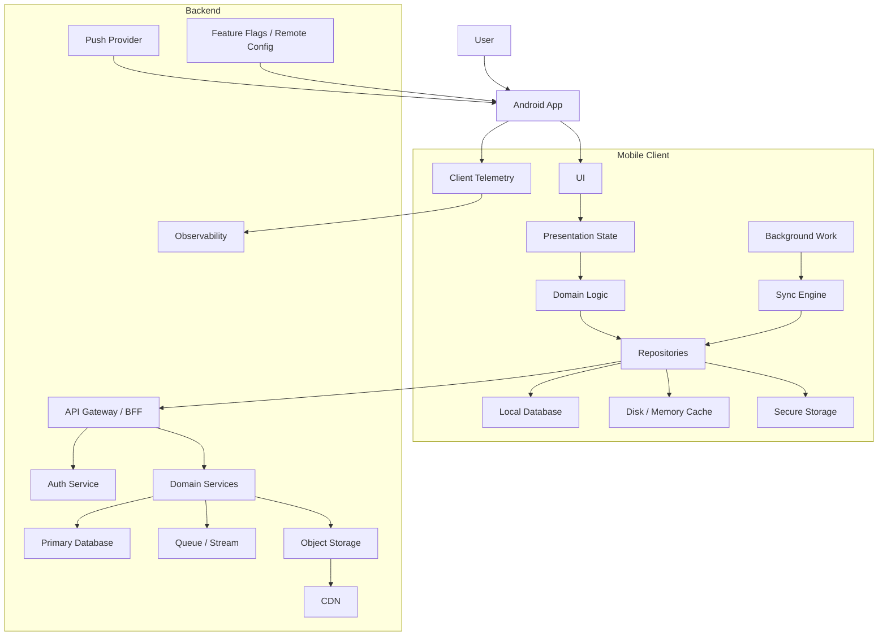

# Mobile System Overview

```mermaid
flowchart TB
    User["User"]
    App["Android App"]

    subgraph Client["Mobile Client"]
        UI["UI"]
        State["Presentation State"]
        Domain["Domain Logic"]
        Repo["Repositories"]
        DB["Local Database"]
        Cache["Disk / Memory Cache"]
        Secure["Secure Storage"]
        Worker["Background Work"]
        Sync["Sync Engine"]
        Telemetry["Client Telemetry"]
    end

    subgraph Backend["Backend"]
        Gateway["API Gateway / BFF"]
        Auth["Auth Service"]
        DomainSvc["Domain Services"]
        Store["Primary Database"]
        Queue["Queue / Stream"]
        ObjectStore["Object Storage"]
        CDN["CDN"]
        Push["Push Provider"]
        Obs["Observability"]
        Flags["Feature Flags / Remote Config"]
    end

    User --> App
    App --> UI
    UI --> State
    State --> Domain
    Domain --> Repo
    Repo --> DB
    Repo --> Cache
    Repo --> Secure
    Repo --> Gateway
    Worker --> Sync
    Sync --> Repo
    App --> Telemetry
    Telemetry --> Obs
    Gateway --> Auth
    Gateway --> DomainSvc
    DomainSvc --> Store
    DomainSvc --> Queue
    DomainSvc --> ObjectStore
    ObjectStore --> CDN
    Push --> App
    Flags --> App
```

