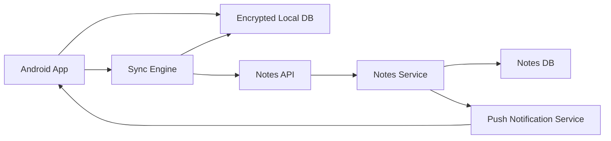

# Example: Offline-First Notes App

Design a mobile notes app where users can create, edit, delete, and sync notes across devices.

## Scope

In scope:

- Android app.
- Create, edit, delete, and list notes.
- Offline read and write.
- Multi-device sync.
- Basic conflict handling.

Out of scope:

- Rich collaborative editing.
- End-to-end encryption.
- Shared notebooks.
- Web client.

## Functional Requirements

- User can create a note offline.
- User can edit a note offline.
- User can delete a note offline.
- User can view cached notes offline.
- User can sync notes across devices.
- User can recover from sync errors.
- User sees pending sync state.

## Non-Functional Requirements

- Local note list opens in under 500 ms for cached data.
- Writes should never be lost after the user taps save.
- Sync should be resilient to network failures.
- Duplicate creates and updates should be prevented.
- Sensitive note content should be encrypted at rest.
- Backend must support older app versions.
- App should avoid aggressive background battery usage.

## High-Level Architecture



## Client Architecture

- UI observes notes from local database.
- Repository exposes note streams and write methods.
- Writes are persisted locally first.
- Sync engine uploads pending mutations.
- Background worker retries sync when network is available.
- Push notifications trigger lightweight sync when possible.
- Secure storage stores auth tokens.

## Data Model

Local note:

```text
note_id
server_id nullable
title
body
created_at
updated_at
deleted_at nullable
version
sync_state: synced | pending_create | pending_update | pending_delete | failed
last_sync_error nullable
```

Pending mutation:

```text
mutation_id
note_id
operation: create | update | delete
payload
base_version
created_at
attempt_count
last_attempt_at nullable
```

## API Shape

```text
POST /notes
PUT /notes/{id}
DELETE /notes/{id}
GET /notes?updated_after={cursor}
POST /notes:batchSync
```

Each write includes:

- Idempotency key.
- Client mutation ID.
- Base version.
- Updated note fields.

## Sync Strategy

1. User edits a note.
2. App writes note and pending mutation to local database in one transaction.
3. UI immediately reflects local state with pending indicator.
4. Sync worker sends pending mutation to server.
5. Server applies mutation if version is valid.
6. Server returns canonical note and new version.
7. App marks mutation synced and updates local note.

## Conflict Handling

For a simple notes app:

- If the user edits different fields on different devices, merge fields where possible.
- If both devices edit the body, create a conflict copy or use latest server version plus local unsynced draft.
- Deletes win over stale edits unless product requires restore.

Staff-level note: do not pretend conflict handling is purely technical. The right strategy depends on product expectations and user trust.

## Failure Modes

- Network unavailable: keep mutation pending and retry later.
- App killed during save: local database transaction preserves note and mutation.
- Duplicate create request: server deduplicates using idempotency key.
- Token expires during sync: pause sync, refresh token, retry.
- Backend unavailable: keep local data usable and surface sync status.
- Local database migration fails: fallback to backup or force safe resync after preserving local pending mutations.

## Observability

Track:

- Pending mutation queue size.
- Sync success rate.
- Sync latency.
- Conflict count.
- Failed mutation count.
- Local database write failures.
- Notes screen load time.
- Crashes and ANRs by app version.

## Rollout

- Ship sync engine behind feature flag.
- Enable for internal users.
- Roll out by percentage and app version.
- Monitor failed mutation rate and conflict rate.
- Keep kill switch to pause background sync.
- Maintain old API behavior for older app versions.

## Tradeoffs

This design optimizes for local durability and offline-first UX. It accepts eventual consistency and some conflict complexity. For real-time collaborative editing, this design would need operational transforms, CRDTs, or a different collaboration-specific data model.

