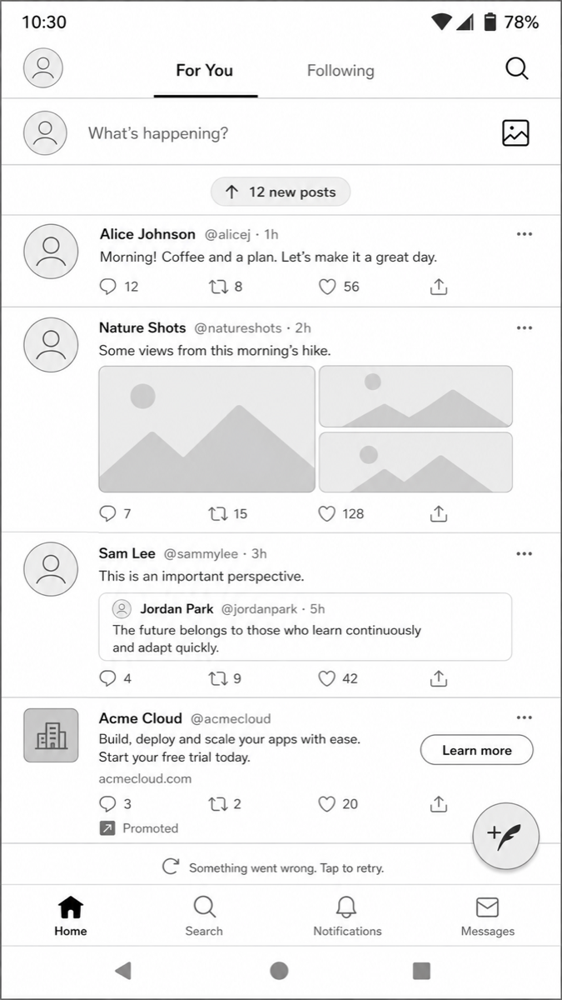
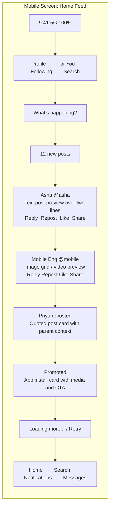
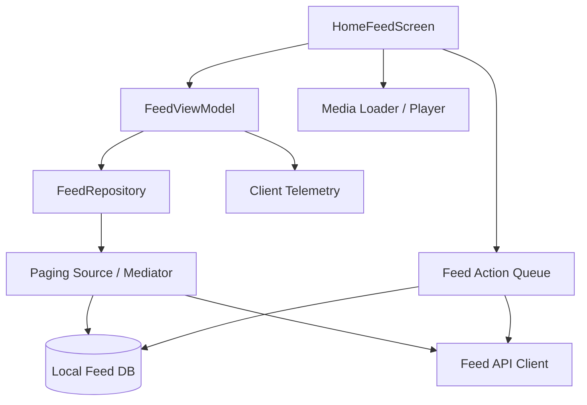
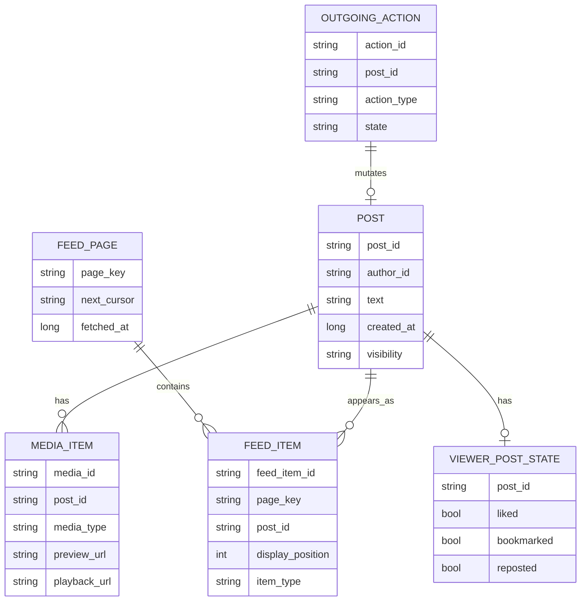
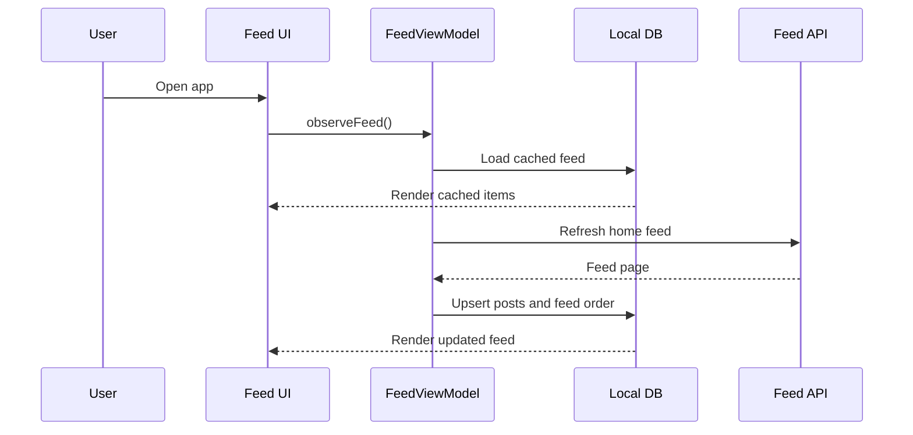
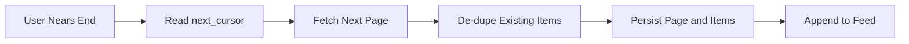
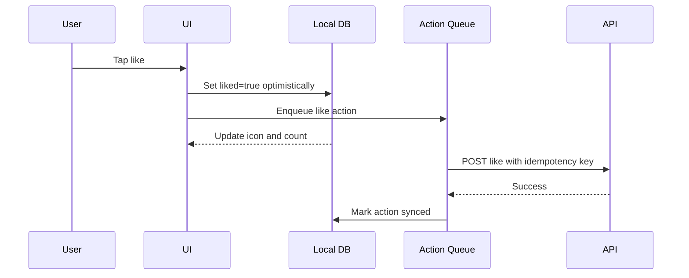
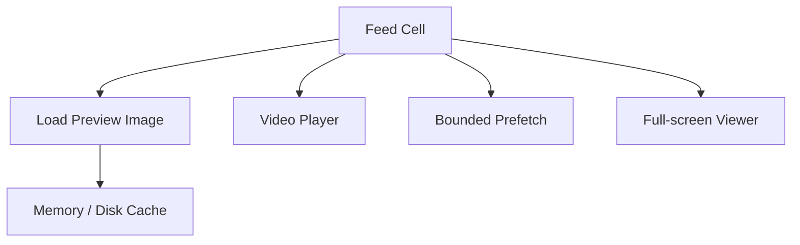

# Design Twitter Feed - Senior Engineer

Design the Android home feed for a Twitter-like app. This senior-level version focuses on the mobile product experience, client architecture, local state, pagination, media rendering, API contracts, and common failure handling.

For staff-level depth across ranking, fanout, cache topology, large-scale backend architecture, experimentation, and operational strategy, continue to [Design Twitter Feed - Staff Engineer](twitter-feed-staff.md).

## Scope

In scope:

- Android home timeline.
- Feed items: text posts, images, videos, reposts, quotes, replies, ads/promoted posts.
- Pull-to-refresh.
- Infinite scroll pagination.
- Local caching.
- Like, repost, bookmark, reply, share actions.
- Basic offline read from cache.
- Media loading and playback.
- Error, empty, loading, and retry states.

Out of scope:

- Full ranking model design.
- Ads auction system.
- Complete moderation system.
- Creator monetization.
- Spaces/live audio.
- Direct messages.

## Functional Requirements

- User can open the app and see a home feed.
- User can refresh the feed.
- User can scroll and load older items.
- User can see text, image, video, repost, quote, and reply items.
- User can like, repost, bookmark, reply, and share.
- User can open a post detail screen.
- User can tap media to view it full-screen.
- User can see cached feed data when offline.
- User can recover from load failures with retry.
- User can see optimistic action updates for like/bookmark/repost.

## Non-Functional Requirements

- Feed should render quickly from cached data.
- First network refresh should complete quickly on healthy networks.
- Scrolling should remain smooth with mixed text, image, and video cells.
- Feed actions should feel instant through optimistic updates.
- Duplicate feed items should not appear across pages.
- The app should avoid excessive battery, memory, and network usage.
- Media prefetch should be bounded.
- The UI should tolerate stale data and reconcile after refresh.

## UI Wireframe

This wireframe makes the home feed surface concrete before moving into architecture, pagination, and caching.





Feed UI states to cover in an interview:

- Cached feed while refresh is running.
- Initial loading state.
- Pull-to-refresh loading state.
- Inline next-page retry.
- Offline banner with cached content.
- Optimistic like/bookmark/repost state.
- Media loading placeholder and video playback state.

## High-Level Mobile Architecture



Recommended Android approach:

- Use local database as the UI source of truth.
- Use a paging layer to combine local cache and network fetches.
- Store feed item order separately from post content.
- Use optimistic local mutations for likes, bookmarks, and reposts.
- Use a bounded media cache and avoid full-resolution image decoding in feed cells.

## Feed Screen State

```text
items: List<FeedItemUiModel>
is_initial_loading
is_refreshing
is_loading_next_page
next_cursor nullable
last_refresh_time
error_state nullable
offline_mode
scroll_anchor
```

Feed item UI model:

```text
feed_item_id
post_id
author
text
media_preview_refs
social_counts
viewer_state: liked | bookmarked | reposted
item_type: post | repost | quote | reply | promoted
ranking_reason nullable
created_at
display_position
```

## Local Data Model



## API Shape

Fetch home feed:

```text
GET /v1/feed/home?cursor={cursor}&limit={limit}
```

Response:

```text
{
  "items": [
    {
      "feed_item_id": "...",
      "post": {...},
      "author": {...},
      "media": [...],
      "viewer_state": {...},
      "ranking_reason": "Because you follow ...",
      "cursor": "..."
    }
  ],
  "next_cursor": "...",
  "refresh_cursor": "...",
  "server_time": "..."
}
```

Actions:

```text
POST /v1/posts/{post_id}/like
DELETE /v1/posts/{post_id}/like
POST /v1/posts/{post_id}/bookmark
DELETE /v1/posts/{post_id}/bookmark
POST /v1/posts/{post_id}/repost
DELETE /v1/posts/{post_id}/repost
```

API concerns:

- Cursor pagination, not offset pagination.
- Stable IDs for de-duplication.
- Partial response fields to avoid oversized payloads.
- Versioned response schema.
- Idempotency keys for actions.
- Clear error model for auth, rate limit, deleted content, and network failures.

## Feed Load Flow



## Pagination Flow



Pagination rules:

- Use server cursor from the previous response.
- De-duplicate by `post_id` or `feed_item_id`.
- Preserve stable item order.
- Show inline loading and retry for next-page failures.
- Avoid clearing the visible feed during refresh.

## Optimistic Action Flow



Failure handling:

- Retry transient failures with backoff.
- Revert optimistic state for permanent failures.
- Coalesce rapid like/unlike toggles before sending.
- Keep user-visible state consistent with the final queued action.

## Media Handling

Feed media should be fast but bounded.



Design choices:

- Load thumbnails/previews in feed cells.
- Decode images at display size.
- Autoplay video only when visible and user settings allow it.
- Pause video when off-screen.
- Use one or limited active players.
- Respect data saver and cellular settings.
- Bound memory and disk cache.

## Failure Modes

| Failure | User Experience | Mitigation |
| --- | --- | --- |
| First refresh fails | Cached feed remains visible | Show non-blocking error and retry |
| Next page fails | Feed remains usable | Show inline retry at bottom |
| Like action fails transiently | Action stays pending | Retry from queue |
| Like action fails permanently | State may be wrong | Reconcile and explain if needed |
| Duplicate posts across pages | User sees repeated content | De-dupe before persisting |
| Large media causes jank | Feed scroll stutters | Thumbnails, bounded prefetch, scaled decode |
| Auth expires | Feed cannot refresh | Refresh token and retry |

## Testing Strategy

- Unit test feed reducers and optimistic action coalescing.
- Repository tests for cache plus network pagination.
- Database migration tests.
- UI tests for loading, empty, error, and retry states.
- Performance tests for scroll smoothness and media-heavy feeds.
- Manual tests for slow network, offline mode, process death, and low-memory devices.

## Senior-Level Tradeoffs

- Local-first rendering improves perceived speed but requires reconciliation.
- Cursor pagination avoids offset instability but requires careful state handling.
- Optimistic actions feel fast but need durable queues and conflict handling.
- Media prefetch improves UX but can hurt battery, memory, and data usage.
- A single feed endpoint is simpler for the app, but backend teams may need a BFF to shield the client from ranking and aggregation complexity.
