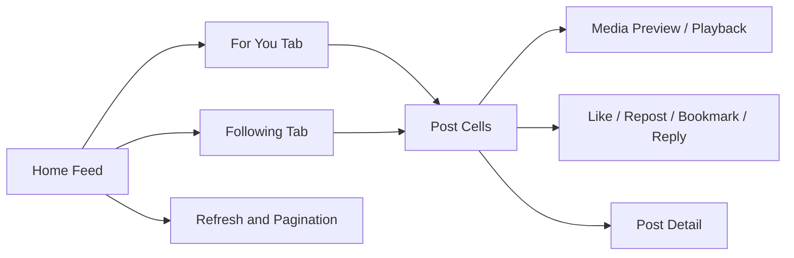
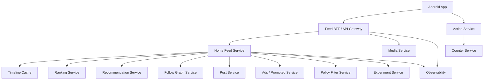
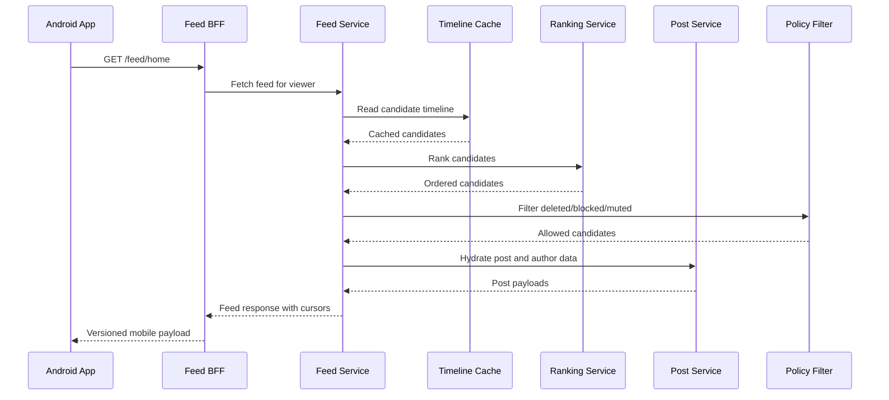
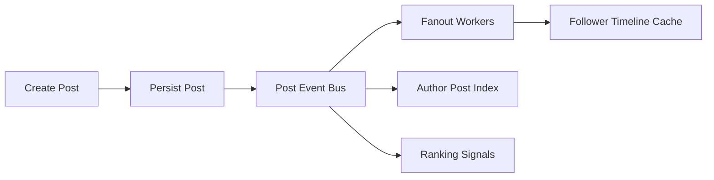
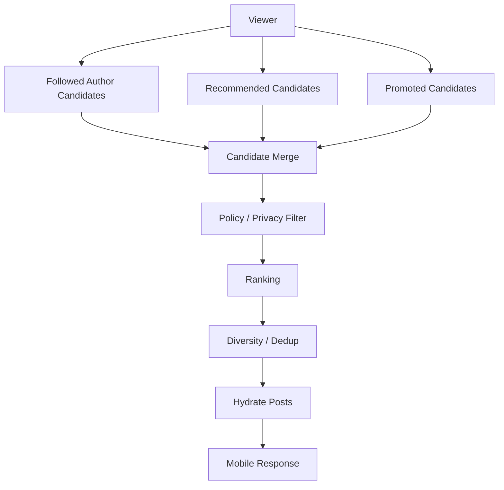
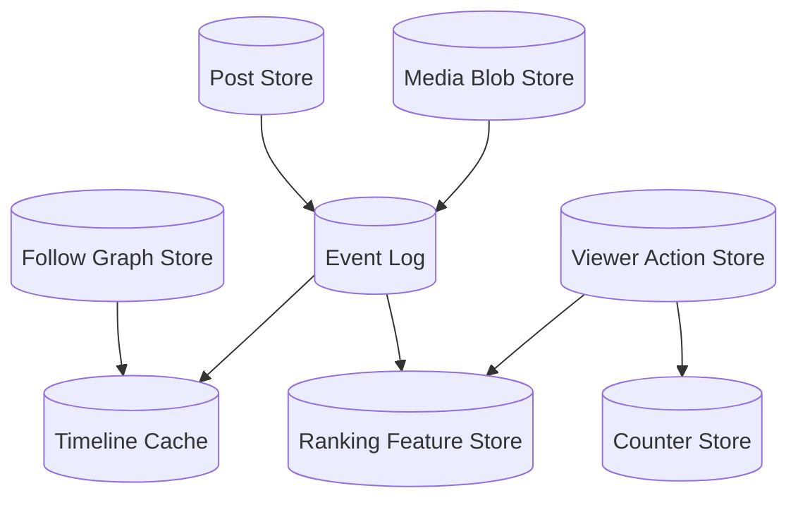
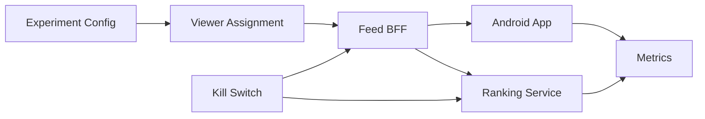

# Design Twitter Feed - Staff Engineer

Design the end-to-end Twitter-like home feed system across Android, edge APIs, ranking, fanout, storage, media delivery, experimentation, observability, and rollout.

This staff-level version assumes the senior-level mobile feed design in [Design Twitter Feed - Senior Engineer](twitter-feed-senior.md) and expands into system-scale architecture and cross-team tradeoffs.

## Scope

In scope:

- Android home feed.
- Feed generation and ranking.
- Follow graph integration.
- Fanout strategy.
- Read path and write path.
- Timeline cache.
- Media delivery.
- Feed actions and counters.
- Ads/promoted item insertion at a high level.
- Experimentation and feature flags.
- Observability, reliability, and rollout.

Out of scope:

- Exact ML model architecture.
- Ads auction internals.
- Complete trust and safety platform.
- Search indexing.
- Direct messages.

## Functional Requirements

- User can open a ranked home feed.
- User can refresh for newer content.
- User can paginate older content.
- Feed contains posts from followed accounts and recommended content.
- Feed supports text, media, reposts, quotes, replies, and promoted items.
- User actions update viewer state: like, repost, bookmark, reply.
- System can insert ads and recommendations without breaking pagination.
- System can remove deleted, blocked, muted, or policy-violating content.
- System supports feed experiments by cohort.

## Non-Functional Requirements

- Low latency for feed open and refresh.
- High availability for feed reads.
- Eventual consistency is acceptable for counts and ranking updates.
- Stronger correctness is required for privacy, block/mute, and deleted content filtering.
- Feed should scale to many users and high write volume.
- The system should degrade gracefully when ranking or recommendation services fail.
- Backend APIs must support older app versions.
- Observability should allow debugging feed quality and reliability without exposing sensitive content.

## Product Surface Context

The staff-level architecture still needs to start from the user-visible surface. The backend feed system exists to power this mobile experience reliably.



Staff-level discussion should connect every backend decision to visible behavior: feed open latency, duplicates, stale content, deleted content removal, ranking quality, media availability, pagination consistency, and action correctness.

## High-Level Architecture



## Read Path

The read path should be optimized for fast app open and refresh.



Degradation:

- If ranking fails, use cached rank or reverse chronological fallback.
- If recommendations fail, return followed-author content only.
- If ads fail, return organic feed.
- If hydration partially fails, omit unavailable items and preserve cursor semantics.

## Write Path and Fanout

When a user posts, the system must decide how followers discover that post.



Fanout options:

| Strategy | How It Works | Pros | Cons |
| --- | --- | --- | --- |
| Fanout on write | Push new post IDs into follower timelines | Fast reads | Expensive for celebrities |
| Fanout on read | Pull posts from followed authors during feed read | Cheaper writes | Slower reads |
| Hybrid fanout | Write fanout for normal users, read fanout for high-fanout users | Balanced | More complex |

Recommended approach:

- Use hybrid fanout.
- Fan out normal users' posts into follower timeline caches.
- For celebrity/high-fanout accounts, pull recent posts at read time.
- Re-rank combined candidates before returning the feed.

## Feed Generation Pipeline



Ranking inputs:

- Follow relationship.
- Recency.
- Engagement probability.
- Author affinity.
- Media type.
- Viewer language/locale.
- Negative feedback.
- Mute/block/report state.
- Experiment assignment.

Staff-level note: ranking quality and system reliability are coupled. A feed that is technically available but low quality may still be a product failure.

## Data and Storage Architecture



Storage ownership:

- Post Service owns canonical post content.
- Graph Service owns follow/block/mute relationships.
- Timeline Cache owns feed candidate ordering snapshots.
- Action Service owns viewer actions.
- Counter Service owns eventually consistent counts.
- Media Service owns media metadata and CDN references.
- Feature Store owns ranking features and model inputs.

## Cursor and Pagination Semantics

Feed pagination is hard because ranking changes while the user scrolls.

Use opaque cursors:

```text
cursor = encoded {
  viewer_id,
  feed_session_id,
  position,
  ranking_version,
  experiment_ids,
  issued_at,
  integrity_signature
}
```

Rules:

- Cursor should be opaque to clients.
- Cursor should preserve feed session consistency.
- New refresh can create a new feed session.
- Older-page pagination should avoid duplicates and missing items.
- Server should filter unavailable content even for old cursors.
- Ads/recommendations must preserve pagination semantics.

## Mobile API Contract

```text
GET /v2/feed/home?cursor={cursor}&limit={limit}
```

Response:

```text
{
  "feed_session_id": "...",
  "items": [...],
  "next_cursor": "...",
  "refresh_cursor": "...",
  "ranking_version": "...",
  "experiments": {...},
  "server_time": "..."
}
```

BFF responsibilities:

- Return mobile-shaped payloads.
- Hide backend service topology from the app.
- Enforce response size limits.
- Version response fields.
- Include media preview URLs and playback metadata.
- Include viewer action state.
- Include stable item IDs for diffing and de-duplication.

## Consistency Model

Strong or near-strong consistency:

- Deleted posts should disappear quickly.
- Blocked or muted authors should not appear.
- Private/protected content must respect authorization.
- Auth and viewer identity must be correct.

Eventual consistency:

- Like/repost/bookmark counters.
- Recommendation scores.
- Ranking feature updates.
- Timeline cache propagation.
- Media transcoding availability.

## Reliability and Failure Modes

| Failure | Impact | Mitigation |
| --- | --- | --- |
| Ranking service down | Feed quality drops or feed unavailable | Cached ranking, chronological fallback |
| Timeline cache miss | Higher latency | Rebuild from graph and author indexes |
| Graph service slow | Candidate generation slow | Use cached graph snapshot with TTL |
| Post hydration partial failure | Missing items | Drop failed items and over-fetch candidates |
| Counter service lag | Counts stale | Return stale counts and reconcile later |
| Media CDN issue | Media unavailable | Show text and retry media load |
| Experiment config bad | Bad feed behavior | Kill switch and scoped rollout |
| Celebrity post causes fanout spike | Queue backlog | Hybrid fanout and celebrity pull model |

## Observability

System metrics:

- Feed API latency percentiles.
- Feed API error rate.
- Timeline cache hit rate.
- Candidate generation latency.
- Ranking latency.
- Hydration failure rate.
- Cursor pagination duplicate rate.
- Fanout queue lag.
- Action write success rate.
- Media load success rate.

Product quality metrics:

- Feed open success.
- Time to first content.
- Scroll depth.
- Refresh rate.
- Engagement per feed session.
- Negative feedback.
- Hide/mute/block/report actions.
- Ad load and ad interaction metrics.

Client metrics:

- Cached feed render time.
- Network refresh time.
- Paging failure rate.
- Scroll jank.
- Image/video decode failures.
- Memory pressure.
- Optimistic action rollback rate.

## Experimentation and Rollout



Rollout plan:

- Dark launch new feed fields.
- Shadow-rank without affecting users.
- Enable internal users.
- Roll out by app version, country, and percentage.
- Monitor latency, error rate, engagement, negative feedback, and crash-free sessions.
- Keep fallback to previous ranking version.
- Keep BFF backward-compatible for old clients.

## Staff-Level Tradeoffs

- Fanout-on-write gives fast reads but creates write amplification.
- Fanout-on-read reduces write cost but increases read latency.
- Hybrid fanout is operationally harder but usually necessary at large social scale.
- Ranking improves relevance but complicates pagination, debugging, and explainability.
- Local cache improves mobile UX but can show stale or deleted content unless refresh and filtering are carefully designed.
- Ads and recommendations add business value but increase feed assembly complexity and quality risk.
- Strong filtering for privacy/block/delete must take priority over feed freshness and ranking.

## Follow-Up Discussion Points

- How would you support "Following" and "For You" tabs differently?
- How would you debug why a user saw a specific post?
- How would you handle celebrity accounts with hundreds of millions of followers?
- How would you support regional outages?
- How would you design feed ranking explainability?
- How would you prevent duplicate posts across organic, recommended, and promoted sources?
