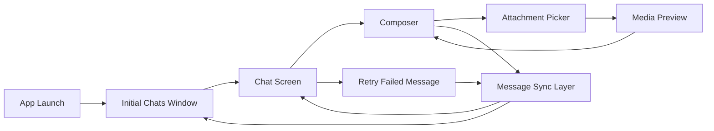
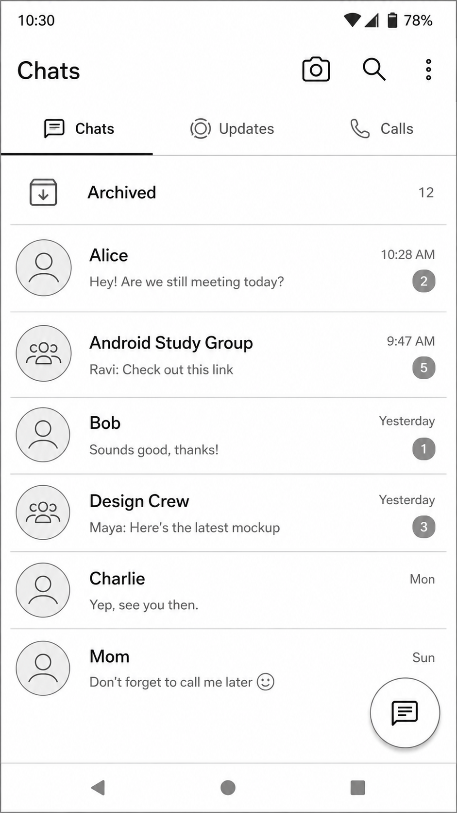
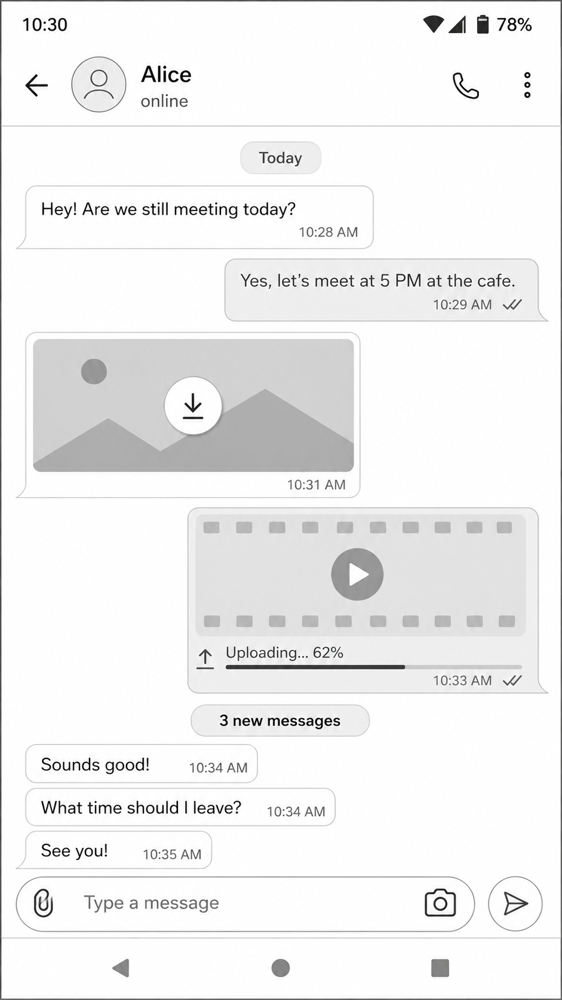
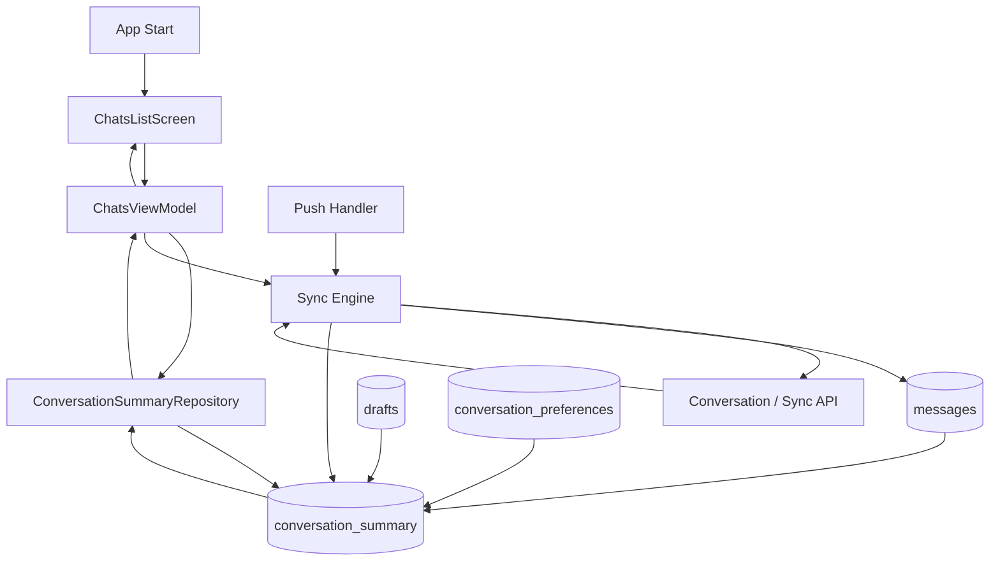
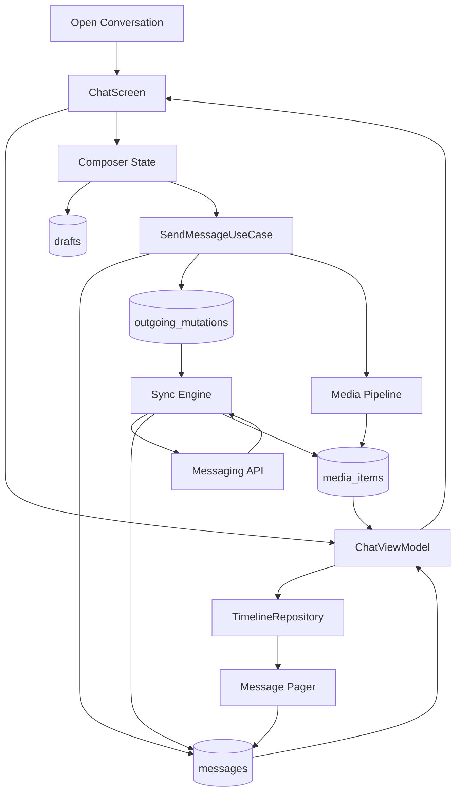
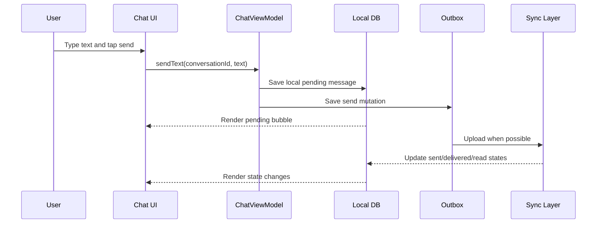
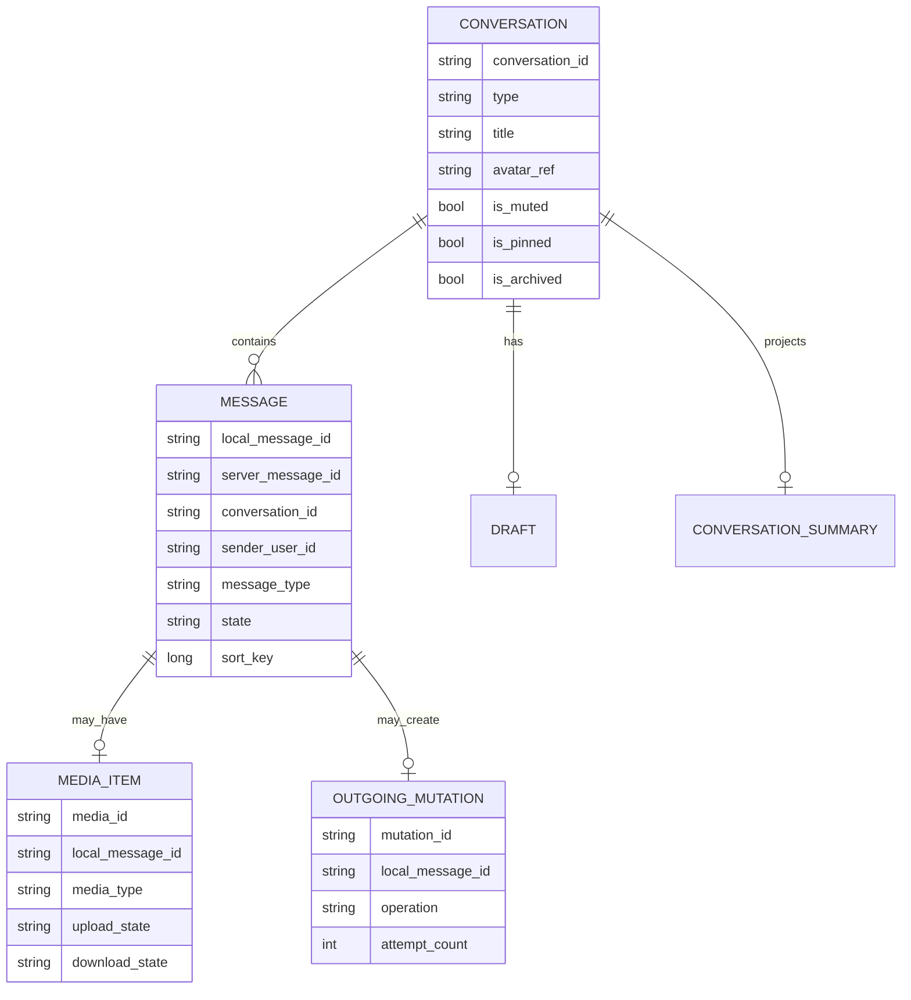
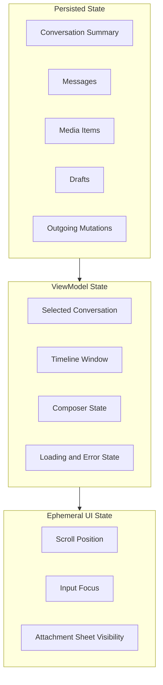

# Design WhatsApp Chats List and Chat Screen

Design the Android product surfaces for a WhatsApp-like messaging app: the initial chats window and the individual chat screen. This chapter focuses on client architecture, local state, UI data models, paging, text/media rendering, and user interaction flows.

For senior engineers, this is a strong end-to-end mobile design problem because it covers product scope, screen ownership, state management, persistence, rendering performance, media handling, offline behavior, and API contracts.

For staff engineers, this chapter should be paired with [Design WhatsApp Message Sync](whatsapp-message-sync.md). The chat UI can look correct only if the underlying sync, delivery, encryption, fanout, and multi-device behavior are designed well.

## Scope

In scope:

- Android client.
- Initial chats window showing recent conversations.
- Individual chat screen showing a paginated message timeline.
- One-to-one conversations.
- Group conversations.
- Text messages.
- Media messages: images, videos, files, upload progress, download progress, retry, and completed states.
- Local-first rendering.
- Drafts.
- Unread counts.
- Delivery/read indicators.
- Basic search/filter entry points.

Out of scope:

- Message sync protocol details. See [Design WhatsApp Message Sync](whatsapp-message-sync.md).
- Full cryptographic protocol design.
- Voice/video calls.
- Payments.
- Stories/status updates.
- Contact discovery.
- Complete abuse and moderation system.

## Functional Requirements

- User can open the app and immediately see the chats window.
- User can see recent conversations ordered by latest activity.
- User can see last message preview, timestamp, unread count, mute/pin/archive state, and draft indicator.
- User can tap a conversation and open the chat screen.
- User can view recent local messages before network refresh completes.
- User can page older messages.
- User can send text messages.
- User can attach and send images, videos, and files.
- User can see upload, download, failed, retry, and completed states for media messages.
- User can see pending, sent, delivered, read, and failed states.
- User can retry failed messages.
- User can receive new messages while viewing a chat.
- User can stay anchored while reading older messages when new messages arrive.

## Non-Functional Requirements

- Chats window should render quickly from local cache.
- Chat screen should open quickly with recent local messages.
- Scrolling should remain smooth with mixed text and media cells.
- Sending should feel instant through optimistic local writes.
- Drafts should not be lost after process death.
- Media processing should not block the main thread.
- The UI should tolerate stale cached data and reconcile after sync.
- The app should avoid excessive battery and network usage.
- Accessibility should support screen readers, dynamic font, and clear touch targets.

## Product Surface Overview



## UI Wireframes

These wireframes are intentionally simple. Their job is to make the product surface concrete before discussing architecture.

### Chats Window UI



Chats window states to show in an interview:

- Cached content while refresh is in progress.
- Empty state for a new user.
- Offline banner when refresh fails.
- Inline unread count updates.
- Draft and pending-message indicators.

### Chat Screen UI



Chat screen states to show in an interview:

- Initial local messages while sync catches up.
- Loading older messages at the top.
- User scrolled up while new messages arrive.
- Pending outgoing text message.
- Media upload progress and retry.
- Media download placeholder on cellular or data saver.

## Chats Window

The chats window is a summary projection over conversations, messages, drafts, unread state, and user preferences. It should not decrypt or load full message history just to render rows.

### Chats Window Requirements

- Show pinned conversations first.
- Sort remaining conversations by latest activity.
- Show title, avatar, last message preview, timestamp, unread count, and mute/archive indicators.
- Show latest outgoing message delivery state when useful.
- Show draft preview above last message preview.
- Render from local storage first.
- Refresh summaries after push, app launch, reconnect, and foreground transition.

### Chats Window Architecture



### Conversation Summary Model

```text
conversation_id
title
avatar_ref
type: direct | group
last_message_id
last_message_preview
last_activity_at
unread_count
is_muted
is_pinned
is_archived
draft_preview nullable
latest_outgoing_state nullable
sort_bucket
```

Implementation notes:

- Store `conversation_summary` as a local projection optimized for rendering.
- Update it in the same transaction as message inserts where possible.
- Keep previews short and safe for notification/privacy settings.
- Use stable row keys to avoid list jank.
- Avoid main-thread avatar decoding or media thumbnail work.

## Chat Screen

The chat screen is a timeline plus a composer. Its main challenge is preserving smooth interaction while messages, media, sync updates, and local pending writes change underneath it.

### Chat Screen Requirements

- Show newest messages first on open.
- Page older messages as the user scrolls upward.
- Preserve scroll position when older pages load.
- Append incoming messages if the user is near the bottom.
- Show a new-message indicator if the user is reading older messages.
- Render local pending messages immediately.
- Show delivery/read state transitions without replacing the whole timeline.
- Support text and media message cells.
- Support retry for failed sends/uploads/downloads.
- Save drafts per conversation.

### Chat Screen Architecture



### Timeline State

```text
conversation_id
items: List<TimelineItem>
oldest_loaded_sort_key
newest_loaded_sort_key
has_more_before
is_loading_older
is_syncing_latest
new_message_count_while_scrolled_up
scroll_anchor
```

Timeline item types:

```text
text_message
image_message
video_message
file_message
date_separator
unread_separator
system_message
loading_indicator
```

## Text Message Flow



Text-specific design choices:

- Save text as a pending local message before network send.
- Assign `client_message_id` locally.
- Keep retry linked to the same local bubble.
- Save drafts separately from sent messages.
- Use idempotency so retry does not create duplicate bubbles.

## Media Message Flow

Media messages add a local media pipeline before the final encrypted message envelope is sent.

```mermaid
flowchart LR
    Pick["Pick Attachment"]
    Permission["Validate Permission / URI"]
    Placeholder["Create Local Placeholder"]
    Process["Compress / Transcode / Thumbnail"]
    Encrypt["Encrypt Media Blob"]
    Upload["Resumable Upload"]
    Ref["Receive media_ref"]
    Send["Send Message Envelope"]
    Render["Render Uploaded State"]

    Pick --> Permission
    Permission --> Placeholder
    Placeholder --> Process
    Process --> Encrypt
    Encrypt --> Upload
    Upload --> Ref
    Ref --> Send
    Send --> Render
```



Media item model:

```text
media_id
local_message_id
local_uri nullable
media_type: image | video | file
mime_type
size_bytes
width nullable
height nullable
duration_ms nullable
thumbnail_local_uri nullable
upload_state: local | processing | uploading | uploaded | failed
download_state: not_downloaded | downloading | downloaded | failed
upload_progress
download_progress
encrypted_media_ref nullable
failure_reason nullable
```

Media-specific design choices:

- Persist selected media URI and processing state.
- Use background work for compression, transcoding, and upload.
- Keep upload progress in local storage so process death does not lose state.
- Respect Android scoped storage and permissions.
- Avoid auto-downloading large media on cellular if user settings disallow it.
- Use placeholders and thumbnails to keep scrolling smooth.

## Local Data Model



## UI State Ownership



Ownership rules:

- Persist messages, drafts, media state, and outgoing mutations.
- Keep scroll position and transient sheet state as UI state.
- Rebuild screen state from local database after process death.
- Keep server-authoritative delivery state synced through the message sync layer.

## Performance Considerations

- Use local-first rendering for both screens.
- Keep chats list rows based on summaries, not full message queries.
- Page timeline data instead of loading entire conversations.
- Generate media thumbnails off the main thread.
- Use stable item IDs for timeline cells.
- Avoid expensive recomposition or rebinding for receipt-only updates.
- Cache avatars and thumbnails with bounded disk/memory policy.
- Measure screen open latency, scroll jank, media decode failures, and memory pressure.

## Failure Modes

| Failure | User Experience | Mitigation |
| --- | --- | --- |
| App killed while composing | Draft should remain | Persist drafts per conversation |
| App killed after tapping send | Pending bubble should remain | Save message and outbox mutation transactionally |
| Media upload fails | Bubble shows retry | Persist media state and retry upload |
| New message arrives while user reads history | Do not jump scroll | Show new-message indicator |
| Local summary projection is stale | Chats list looks outdated | Rebuild projection from messages or sync response |
| Large media causes memory pressure | App may jank or crash | Decode scaled thumbnails, stream files, avoid full-size bitmap loads |

## Staff Engineer Note

This chapter intentionally focuses on the visible chat experience. For staff-level interviews, continue into [Design WhatsApp Message Sync](whatsapp-message-sync.md) and explain how the UI states here are powered by durable sync, end-to-end encryption, multi-device fanout, push wakeups, receipts, observability, and rollout safety.
