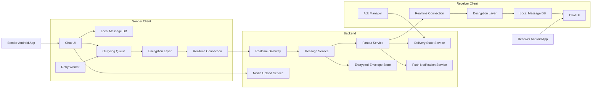
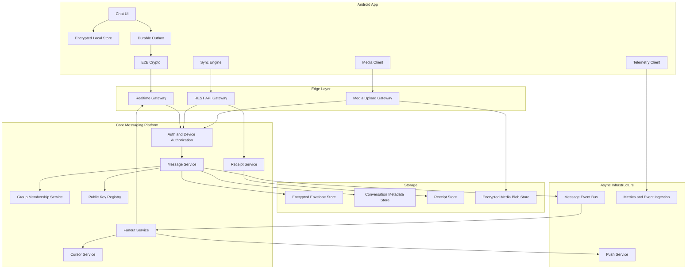
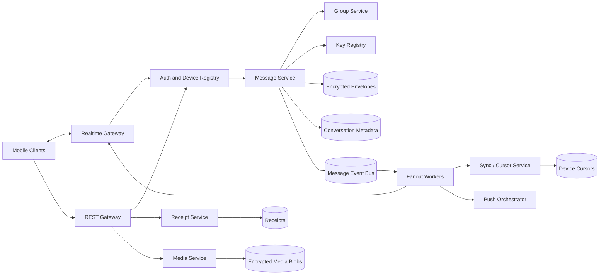
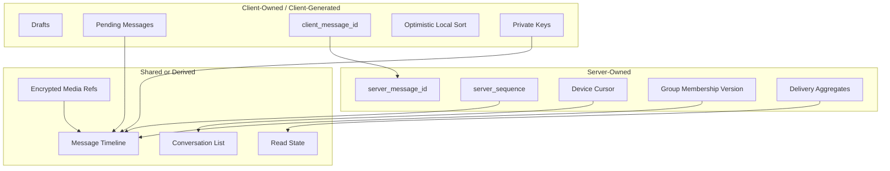
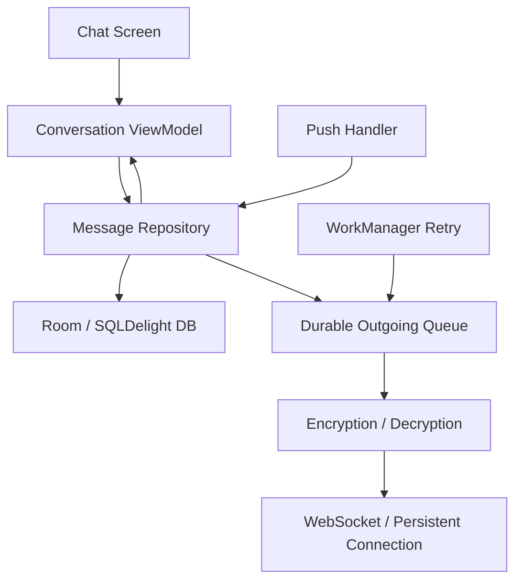
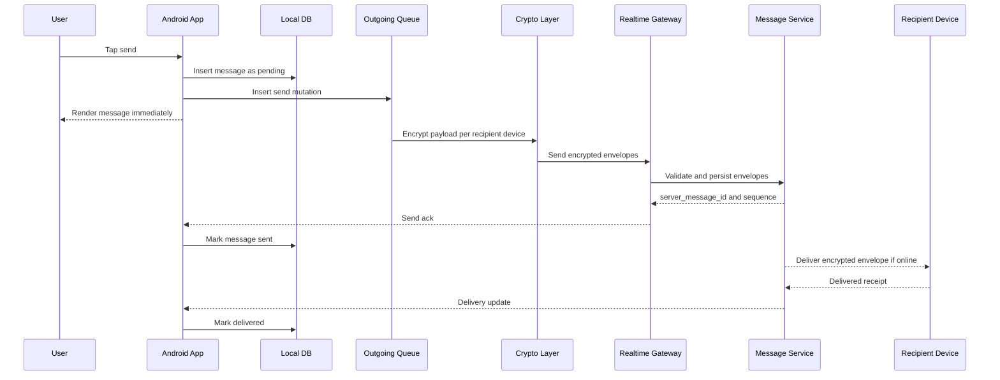
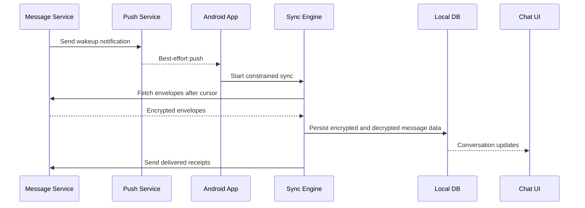
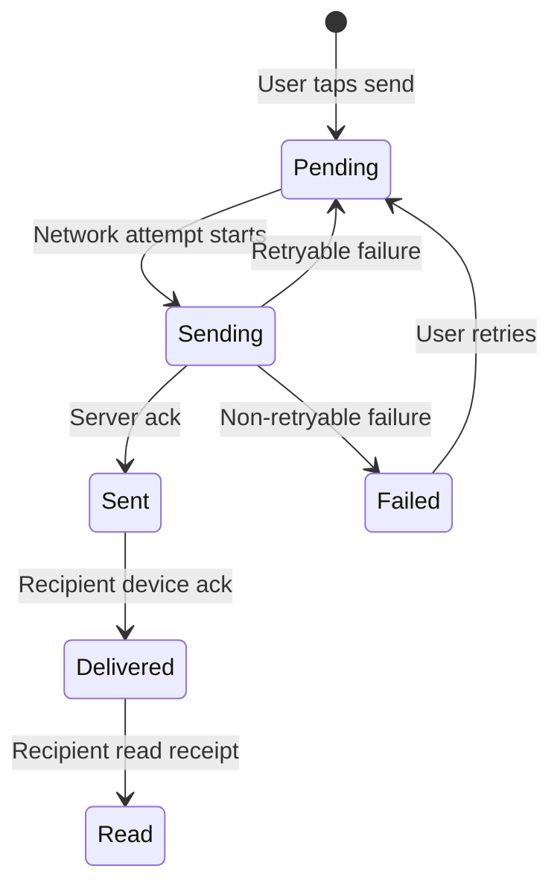

# Design WhatsApp Message Sync

Design a mobile messaging system where users can send and receive one-to-one and group messages across devices with reliable delivery, offline support, and end-to-end encryption.

This is a staff-level mobile system design problem because the hard parts are not just sending text over a socket. The hard parts are local durability, delivery state, multi-device sync, offline queues, push behavior, encryption boundaries, media handling, backward compatibility, and operational visibility without violating privacy.

## Scope

In scope:

- Android client.
- One-to-one messages.
- Group messages.
- Text messages.
- Media message metadata and upload flow.
- Offline send queue.
- Multi-device sync.
- Message delivery states.
- Push-triggered wakeup.
- End-to-end encryption at a high level.

Out of scope:

- Full cryptographic protocol design.
- Voice/video calls.
- Payments.
- Stories/status updates.
- Complete abuse and moderation system.
- Full web or desktop client implementation.

## Functional Requirements

- User can send a text message to another user.
- User can send a message while offline and have it delivered later.
- User can receive messages while the app is foregrounded.
- User can receive messages after reopening the app.
- User can see message states: pending, sent, delivered, read, failed.
- User can sync message history on a new or secondary device.
- User can participate in group conversations.
- User can send media messages with upload progress.
- User can receive push notifications for new messages.
- User can delete local message history from a device.

## Non-Functional Requirements

- Messages should not be lost after the user taps send.
- Common send path should feel instant through optimistic local writes.
- Delivery should tolerate flaky mobile networks.
- The app should avoid excessive battery usage.
- Message content should be end-to-end encrypted.
- Backend should not need plaintext message content.
- System should support old app versions for a reasonable window.
- Message ordering should be stable enough for conversation UX.
- Sync should recover from missed pushes and app process death.
- Observability should track reliability without logging sensitive content.

## Assumptions

- Each user can have multiple devices.
- Each device has a unique `device_id`.
- Server can authenticate users and devices.
- Message content is encrypted on the sender device for recipient devices.
- Server stores encrypted message envelopes and routing metadata.
- Push notifications are best-effort and only used as a wakeup signal.
- Read receipts are enabled by default but can be disabled by user preference.

## High-Level Architecture

At a high level, message sync has four major responsibilities:

- The mobile client owns local durability, optimistic UI, encryption/decryption, and retry.
- The realtime edge owns connection management and low-latency routing.
- The messaging backend owns validation, encrypted envelope persistence, fanout, cursors, and receipts.
- Push and background sync fill gaps when the app is not connected.



## System Architecture

This view separates the online send path, offline sync path, media path, and observability path.



## Backend Service Architecture

The backend should not behave like one large chat server. Splitting responsibilities keeps protocol evolution, fanout, media, receipts, and group membership independently scalable.



Service responsibilities:

| Component | Responsibility |
| --- | --- |
| Realtime Gateway | Maintains WebSocket connections, authenticates devices, routes low-latency envelopes and state updates |
| Message Service | Validates send requests, assigns server IDs/sequences, persists encrypted envelopes |
| Fanout Service | Expands one message into recipient-device deliveries and push wakeups |
| Sync/Cursor Service | Tracks per-device sync cursors and serves missed encrypted envelopes |
| Group Service | Owns membership, roles, membership version, and group metadata |
| Key Registry | Stores public identity/pre-key material needed by clients for encryption |
| Receipt Service | Processes delivered/read receipts separately from message writes |
| Media Service | Handles resumable encrypted media upload/download references |
| Push Orchestrator | Sends best-effort push notifications without being the source of truth |

## Data Ownership Architecture

For staff-level design, call out which data is client-owned, server-owned, and shared. This prevents vague designs where every component appears to own the same state.



Ownership rules:

- Client owns drafts, local pending rows, private keys, and optimistic UI state.
- Server owns canonical IDs, sequence numbers, device cursors, and authorization decisions.
- Message content is shared only as encrypted data. Plaintext exists on authorized clients.
- Receipt state is server-aggregated but user-visible through synced client state.

## Message Lifecycle Architecture

This is the complete lifecycle from local creation to recipient display and receipt propagation.


## Mobile Client Architecture

The Android app should treat the local database as the UI source of truth.

- Chat UI renders messages from local storage.
- Sending a message first writes a local message row in `pending` state.
- Outgoing queue durably stores the send attempt.
- Encryption layer encrypts message payloads before network transmission.
- Realtime connection handles foreground delivery.
- Background worker retries pending sends when constraints allow.
- Push handler wakes the app to pull missed envelopes when possible.
- Ack manager sends delivered/read receipts separately from message content.



## Core Data Model

Conversation:

```text
conversation_id
type: direct | group
participant_user_ids
created_at
last_message_id
last_read_message_id
muted_until nullable
```

Message:

```text
local_message_id
server_message_id nullable
conversation_id
sender_user_id
client_message_id
message_type: text | image | video | file | system
encrypted_payload
created_at_client
created_at_server nullable
sort_key
state: pending | sending | sent | delivered | read | failed
failure_reason nullable
reply_to_message_id nullable
```

Outgoing mutation:

```text
mutation_id
client_message_id
conversation_id
operation: send_message | send_receipt | delete_local
payload
attempt_count
next_attempt_at
created_at
```

Message envelope stored on server:

```text
server_message_id
conversation_id
sender_user_id
recipient_user_id
recipient_device_id
encrypted_payload
client_message_id
server_sequence
created_at_server
expiration_policy
```

## API and Protocol Shape

Realtime send:

```text
SEND_MESSAGE {
  client_message_id,
  conversation_id,
  recipient_device_envelopes[],
  media_refs[],
  created_at_client
}
```

Server response:

```text
SEND_ACK {
  client_message_id,
  server_message_id,
  conversation_id,
  server_sequence,
  created_at_server
}
```

Sync missed messages:

```text
GET /sync/messages?device_id={device_id}&cursor={last_server_sequence}
```

Receipt:

```text
POST /messages/{server_message_id}/receipts
{
  type: delivered | read,
  device_id,
  receipt_time
}
```

Important API properties:

- `client_message_id` supports idempotency.
- `server_sequence` supports ordered sync per recipient device or conversation.
- Receipts are separate from message send.
- Message payload remains encrypted before it reaches the backend.
- APIs must be backward-compatible across app versions.

## Send Flow



## Receive and Sync Flow

Foreground delivery should use a realtime connection. Background or missed delivery should use push as a hint and sync as the source of truth.



## Ordering Model

Message ordering is subtle because clients can be offline and device clocks can be wrong.

Use:

- `created_at_client` for local optimistic placement.
- `created_at_server` for canonical server time.
- `server_sequence` for deterministic sync order.
- Per-conversation ordering for display.
- Pending local messages placed near the user's current timeline position.

If the server ack changes ordering, the UI can gently reconcile without jarring jumps. For staff-level discussion, call out that perfect global ordering is expensive and usually unnecessary for chat UX.

## Offline Behavior

Offline send:

1. User sends message.
2. App stores message in local database as `pending`.
3. App stores send mutation in outgoing queue.
4. UI shows pending state.
5. WorkManager retries when network is available.
6. Server deduplicates using `client_message_id`.
7. App marks message `sent` after server ack.

Offline receive:

- App shows cached conversations.
- Push may be missed while offline.
- On reconnect or app open, sync engine fetches messages after last cursor.
- Sync should be resumable and idempotent.

## Delivery State Machine



State details:

- `pending`: safely stored locally but not accepted by server.
- `sending`: active network attempt in progress.
- `sent`: server accepted and assigned message ID.
- `delivered`: recipient device acknowledged receipt.
- `read`: recipient opened the conversation and sent read receipt.
- `failed`: user-visible failure requiring retry or edit.

## Media Messages

Media send flow:

1. User selects media.
2. App creates local message with media placeholder.
3. App compresses/transcodes if needed.
4. App uploads encrypted media blob to media service.
5. Media service returns `media_ref`.
6. App sends message envelope containing encrypted media metadata.
7. Recipient downloads media lazily or automatically depending on settings.

```mermaid
flowchart LR
    Pick["Pick Media"]
    Local["Create Local Placeholder"]
    Process["Compress / Transcode"]
    Encrypt["Encrypt Blob"]
    Upload["Upload to Media Service"]
    Ref["Receive Media Ref"]
    Send["Send Message Envelope"]
    Recipient["Recipient Downloads"]

    Pick --> Local
    Local --> Process
    Process --> Encrypt
    Encrypt --> Upload
    Upload --> Ref
    Ref --> Send
    Send --> Recipient
```



Mobile constraints:

- Uploads should be resumable.
- Large uploads should respect network and battery constraints.
- Media cache should be bounded.
- User settings may block auto-download on cellular.
- Metadata should avoid leaking sensitive local file information.

## Multi-Device Sync

For each user, the server routes encrypted envelopes to every active device.

Options:

- Fan out on write: create one encrypted envelope per recipient device when the message is sent.
- Fan out on read: store message once and create device-specific envelopes during sync.

Recommended for private messaging: fan out encrypted envelopes per recipient device because each device may have its own encryption keys.

Device sync requirements:

- Each device has its own cursor.
- Each device acknowledges envelopes independently.
- New device registration requires key exchange and history policy.
- Device removal should stop future envelope delivery.
- Old devices may need explicit re-authentication.

## Group Messaging

Group messaging extends the same model:

- Conversation has many participants.
- Sender encrypts payload for recipient devices or for a group sender key, depending on protocol.
- Server fans out encrypted envelopes.
- Membership changes create key rotation requirements.
- Delivery/read receipts can become expensive for large groups.

Optimization:

- For small groups, per-recipient delivery state can be shown.
- For large groups, aggregate or limit receipt visibility.
- Membership and key state should be versioned.

## Security and Privacy

Important principles:

- Server should not receive plaintext message content.
- Message encryption keys should be device-specific or group-session-specific.
- Auth tokens should be stored in Android Keystore-backed storage.
- Local database should encrypt sensitive message content.
- Logs must not contain message text, media URLs, tokens, or encryption keys.
- Push notification payloads should avoid sensitive message content unless user settings allow previews.
- Screenshots and notification previews may need privacy controls.

The client is not fully trusted. Server must still enforce account identity, device authorization, rate limits, group membership, and abuse controls.

## Reliability and Failure Modes

| Failure | Impact | Mitigation |
| --- | --- | --- |
| App killed after send tap | User may fear lost message | Local DB transaction writes message and mutation before network send |
| Network drops during send | Message stuck in sending | Retry from durable queue with backoff |
| Server receives duplicate send | Duplicate message | Deduplicate by sender ID and `client_message_id` |
| Push notification dropped | Missed message alert | Sync on app open and reconnect using cursor |
| Recipient offline | Message not delivered yet | Store encrypted envelope until device syncs |
| Device clock wrong | Incorrect ordering | Use server sequence for canonical order |
| Token expires during sync | Sync failure | Refresh token and resume from cursor |
| Local DB migration fails | Chat unavailable | Block risky release, backup migration, or force safe resync where possible |
| Group membership changes mid-send | Wrong recipients | Version group membership and encryption state |
| Media upload interrupted | Partial media | Resumable upload with content hash and upload session |

## Observability

Track reliability without exposing private content.

Client metrics:

- Send success rate.
- Send latency percentiles.
- Pending queue depth.
- Message retry count.
- Sync cursor lag.
- Realtime connection uptime.
- Push-to-sync success rate.
- Local DB failures.
- Media upload success rate.
- Battery-sensitive background work failures.

Backend metrics:

- Gateway connection count.
- Message acceptance latency.
- Fanout latency.
- Envelope queue depth.
- Receipt processing latency.
- Push send success by provider.
- Duplicate send suppression count.
- Sync API error rate.

Segment by:

- App version.
- OS version.
- Network type.
- Country/region.
- Device class.
- Conversation type.

## Rollout Plan

- Start with internal users and test accounts.
- Gate new sync engine behind remote config.
- Roll out by app version and percentage.
- Monitor pending queue depth and send failure rate.
- Keep kill switch for realtime transport changes.
- Keep backward-compatible message envelope formats.
- Use server-side version negotiation for protocol changes.
- Run shadow metrics before changing delivery state behavior.

## Tradeoffs

This design optimizes for user trust: messages are locally durable, send feedback is immediate, and sync can recover from missed pushes. It accepts eventual consistency for delivery/read states and uses server sequence rather than strict global ordering.

End-to-end encryption limits backend debugging and search capabilities, but it is the right tradeoff for private messaging. Multi-device support adds key management and fanout complexity, but it matches modern user expectations.

## Follow-Up Discussion Points

- How would the design change for very large groups?
- How would you support message search while preserving privacy?
- How would you migrate from single-device to multi-device encryption?
- How would you handle disappearing messages?
- How would you debug delivery issues without plaintext logs?
- How would you design message backup and restore?
