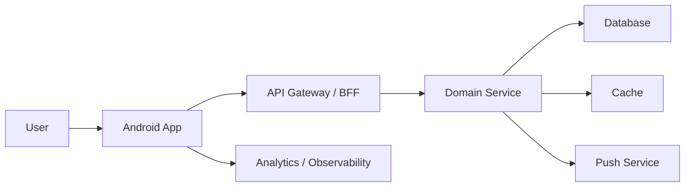

# Mobile System Design Template

Use this template when practicing a design problem.

## Problem

Design:

## Scope

In scope:

- 

Out of scope:

- 

## Users

- 

## Functional Requirements

- 

## Non-Functional Requirements

- 

## Assumptions

- 

## Scale

- DAU/MAU:
- Peak QPS:
- Data volume:
- Devices per user:
- App versions supported:
- Regions:

## High-Level Architecture

## Mobile Client Architecture

- UI:
- State management:
- Local database:
- Network layer:
- Background work:
- Sync engine:
- Secure storage:
- Feature flags:
- Observability:

## Data Model

Entities:

- 

Important fields:

- 

Ownership:

- Server-authoritative:
- Client-derived:
- Locally pending:

## API Design

Endpoints:

- 

API concerns:

- Pagination:
- Delta sync:
- Idempotency:
- Error model:
- Versioning:

## Offline and Sync

- Offline reads:
- Offline writes:
- Queueing:
- Retry policy:
- Conflict detection:
- Conflict resolution:
- Resync:

## Failure Modes

- 

## Security and Privacy

- 

## Performance

- Startup:
- Screen load:
- Scrolling:
- Network:
- Database:
- Battery:
- App size:

## Observability

Metrics:

- 

Logs:

- 

Alerts:

- 

Dashboards:

- 

## Rollout

- Feature flags:
- Staged rollout:
- Kill switch:
- Backward compatibility:
- Migration:

## Tradeoffs

- 

## Future Extensions

- 

